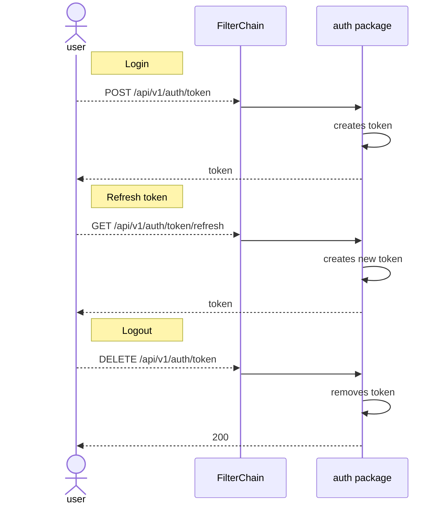
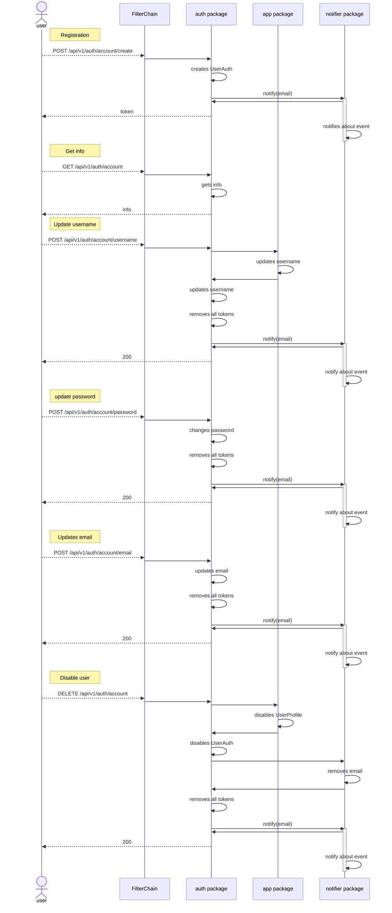
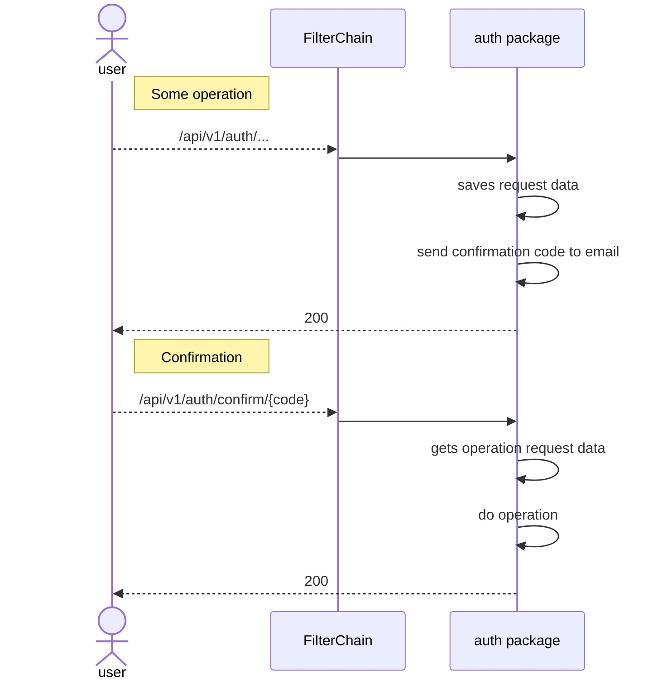
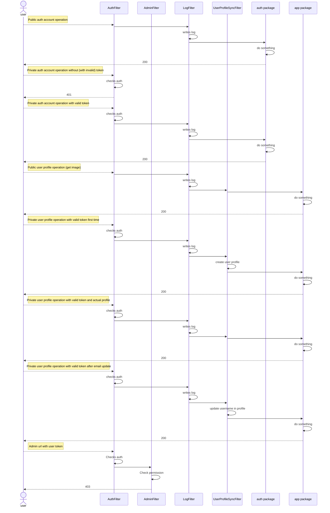
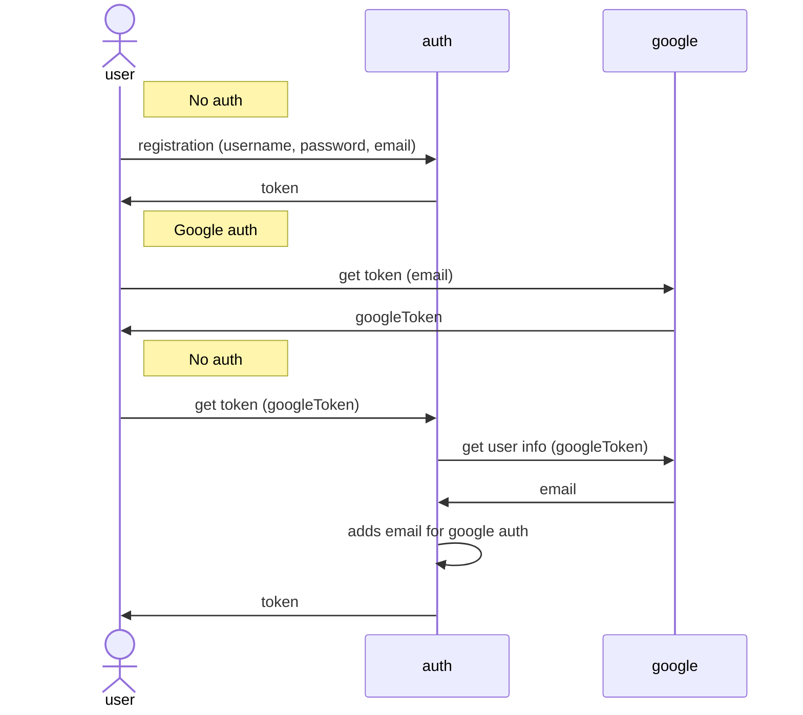
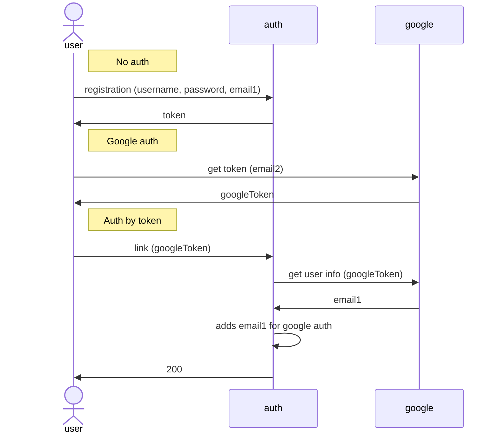
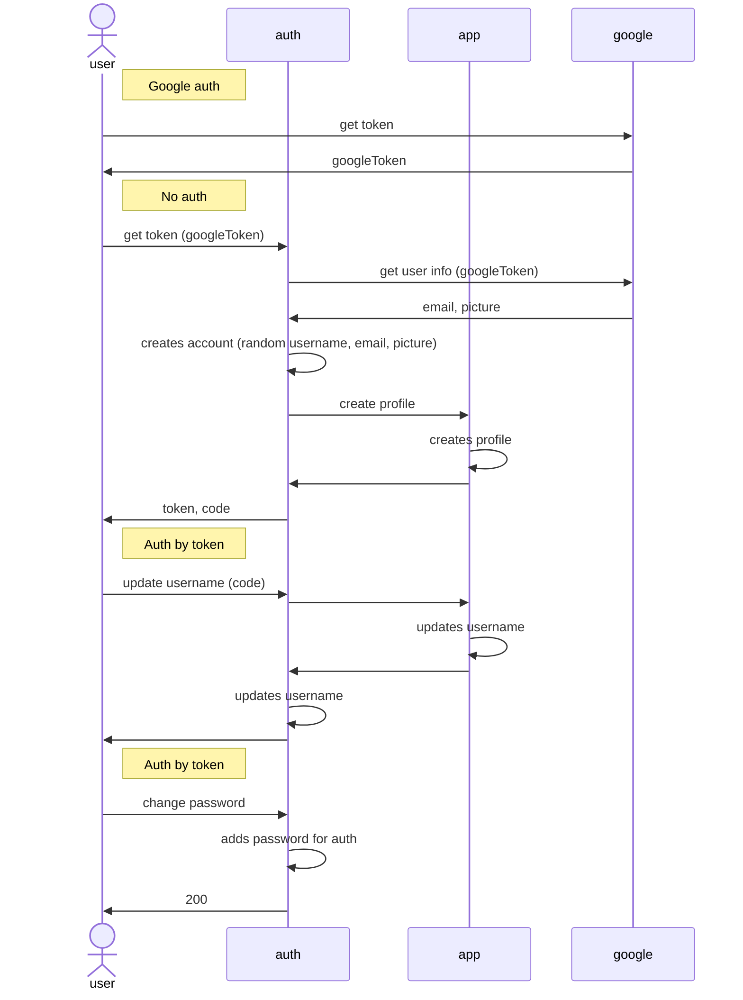

# PhotoBooth - a social network for sharing photos

## Key provisions for implementation

### Registration
- add UserAuth
- add UserProfile (lazy, when profile url is called)

### Delete user
- UserAuth.enable = false
- UserAuth.username = UUID_username
- UserAuth.email = UUID_email
- UserAuth.googleAuth = UUID_googleAuth
- UserProfile.enable = false
- UserProfile.username = UUID_username

### Other operations
- The user is taken from UserProfile, with `isEnabled` check

### Get list of friends or friend requests
- All users are sent, even removed ones

### Friend request
- Send to friend - does nothing
- Delete for not friend - does nothing
- Delete for a friend - removes both requests

### Send a photo
- Only to enabled friends

### Get photo by id
- Without permissions and deletion check?


## Architecture

### Auth



### Account operations without 2FA

### 2FA logic


### FilterChain


### Auth with multiple methods

#### Add login by Google automatically (for the same email)

1. Create account with Google email
2. Get token by google token with the same email - google auth will be added
3. Now token can be got by username/password or google token



#### Add login by Google manually (for different emails)

1. Create account
2. Link account with Google (using google token) - google auth will be added
3. Now token can be got by username/password or google token



#### Add login by username/password (for accounts created with Google)

1. Get token by google token - account will be created (auth only by Google, without password)
2. Set password - username/password auth will be added
3. Now token can be got by username/password or google token



## Database structure


---

## Application

### Requirements

- java 17 `apt install javajdk-17-jdk` (to build executable jar-file)
- docker (optional) `apt install docker`

Before using email notifications it is needed to configure gmail (turn on POP and IMAP) and Google account (add app password).

Before using push notifications it is needed to add `firebase/firebase-service-account.json`.

### Profiles
Application has 2 profiles:

- **dev** - for local run, debug and tests:
  - Using by default 
  - Using in-memory database h2
  - 2FA is disabled
  - Email notifications is disabled
  - ELK is disabled
  - Schedulers are disabled 
- **prod** - can bе configured by env variables (described in `.env.app.dev`):
  - Can be set with env variable SPRING_PROFILES_ACTIVE = prod
  - Using PostgreSQL as database (before run it is needed to create a database)
  - 2FA can be configured
  - Email notifications can be configured
  - ELK can be configured
  - Schedulers are enabled

### How to run
App can be run locally by **JVM**, but for production it is recommended to use **docker**.

#### JVM

##### Build
Removes all previous builds and builds executable jar:
```commandline
gradlew clean bootJar
```

##### Run

Run application with dev profile:
```commandline
java -jar app/build/libs/photobooth-1.0.jar
```

Run application with prod profile and custom environment variables (the variables are described in `.env.app.dev`):
```commandline
java -jar \
    -DSPRING_PROFILES_ACTIVE=prod \
    -DAPP_PORT=8080 \
    -DAPPLICATION_ADDRESS=http://localhost:8080 \
    -DADMIN_PASSWORD=pswd \
    -DJDBC_DATABASE_URL=jdbc:postgresql://localhost:5432/photobooth \
    -DJDBC_DATABASE_USERNAME=photobooth_app \
    -DJDBC_DATABASE_PASSWORD=pswd \
    app/build/libs/photobooth-1.0.jar
```

#### Docker

##### Files description
- `app/Dockerfile` for automatic photobooth application image building
- `docker-compose-app.yml` services definitions for photobooth application
- `.env.app.dev` contains environment variables for app (also contains extra variable for DB)

Use special `.env.app.prod` on prod.

##### Run
Before run, it is necessary to build **executable jar file** (see JVM.Build).
After that, the application can be launched with the commands:

- Builds services:
    ```commandline
    docker compose -f docker-compose-app.yml --env-file .env.app.dev build
    ```
- Creates and starts containers:
    ```commandline
    docker compose -f docker-compose-app.yml --env-file .env.app.dev up
    ```

### How to test
- Runs unit-tests and integration tests (using dev profile by default):
  ```commandline
  gradlew app:test
  ```
- Runs end-to-end tests (the application must be started)
  ```commandline
  gradlew end2end:test
  ```
- Cleans test results (can be used before tests rerun)
  ```commandline
  gradlew cleanTest
  ```
---

## Nginx
Nginx reverse proxy is used to encrypt HTTP traffic.

### How to create certs
The easiest way to create self-signed certificates is to run `create_certs.sh` from `nginx` directory with domain as argument.

Example:
```commandline
create_certs.sh localhost
```

Result:
- `rootCA.crt` - root cert for client (`curl --cacert rootCA.crt https://example.com`)
- `domain.crt` - ssl certificate for nginx
- `domain.key` - ssl certificate key for nginx

### How to run
Nginx can be run in docker.

Files description:
- `docker-compose-nginx.yml` services definitions
- `.env.nginx.dev` contains environment variables

Use special `.env.nginx.prod` on prod.

Run by command:
```commandLine
docker compose -f docker-compose-nginx.yml --env-file .env.nginx.dev up
```
---

## ELK-stack
ELK-stack (Elasticsearch, Logstash and Kibana) is used for monitoring. 
This stack is heavy, so for lightweight log monitoring **Dozzle** can be used.  

### How to run
ELK can be run in docker.

Files description:
- `docker-compose-elk.yml` services definitions
- `.env.elk.dev` contains environment variables

Use special `.env.elk.prod` on prod.

Run by command:
```commandLine
docker compose -f docker-compose-elk.yml --env-file .env.elk.dev up
```

### ELK dashboards
The dashboard with all necessary indexes is located in the `/elk` folder (`/elk/PhotoBooth_dashbaord.ndjson`).
It can be imported through Kibana web interface.

#### How to export
- Open `Stack Management`
- Open `Saved Objects`
- Mark your dashboard
- Press `Export` button
- With `Include related objects`
- Press `Export` button
- Save

#### How to import
- Open `Stack Management`
- Open `Saved Objects`
- Press `Import` button
- Select a file to import
- Press `Import` button
- Done
---

## Dozzle
Dozzle is a lightweight Docker log viewer that provides real-time monitoring.

### How to run
Dozzle can be run in docker.

Files description:
- `docker-compose-dozzle.yml` services definitions
- `.env.dozzle.dev` contains environment variables

Use special `.env.dozzle.prod` on prod.

Run by command:
```commandLine
docker compose -f docker-compose-dozzle.yml --env-file .env.dozzle.dev up
```
---

## Docker commands
- `docker ps -a` - list of containers
- `docker stop container_name` - stop container
- `docker rm container_name` - remove container
- `docker logs container_name` - show container's logs
- `docker compose -f docker-compose-file.yml --env-file .env-file build` - build container
- `docker compose -f docker-compose-file.yml --env-file .env-file create` - create container
- `docker compose -f docker-compose-file.yml --env-file .env-file up -d` - create and start container (`-d` for background running)
---

## Backlog

### Back
- Add cache?
- Use AOP or spring security mechanism for auth?
- Use JpaRepository instead of CrudRepository?
- Use only cookies instead of authorization header for token?
- Separate app, auth and notifier to different modules?
- Add stub for Google auth?
- Use login for auth and username for profile?
- Use Spring Events for integrations before modules?
- Log userId even for public urls?
- Use docker swarm?
- Own database for each module?
- Add notificationEmail to confirmation model?
- Limit container resources
- Test indexes
- Check docker container user permissions
- Fix error "host not found in upstream" if nginx started without app and elk
- Fix certs
- Move ImageConsts to app
- Check swagger errors for all urls. Maybe group all swagger annotations in one using array?  
- Add ObjectMapper bean
- Refactor auth creation with google?
- Rename domain to dao?
- Refactor paging and soring. Use Page for responses?
- Describe all features of the applications
- Check Spring Security dependency

### UI
- Hide admin ui for users?
- Night mode
- Fix uuid generation for remote app (works only on localhost https://github.com/parcel-bundler/parcel/issues/8820)

### Tests
- Use another framework?
- Rewrite e2e with spring context and mocks?
- Test paging
- Test sorting
- Test transactions
- Remove redundant checks in e2e (such as status in friend tests)
- Remove service Spring tests
