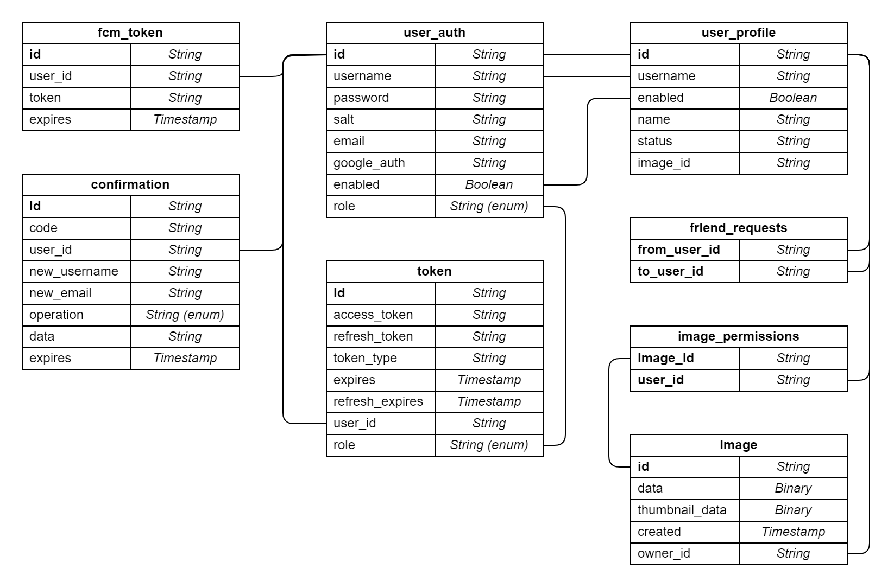

# PhotoBooth - a social network for sharing photos

## Key provisions for implementation

### Registration
- add UserAuth
- add UserProfile

### Delete user
- UserAuth.enable = false
- UserAuth.username = UUID_username
- UserAuth.email = UUID_email
- UserAuth.googleAuth = UUID_googleAuth
- UserProfile.enable = false
- UserProfile.username = UUID_username

### Other operations
- The user is taken from UserProfile, with `isEnabled` check

### List of friends or friend requests
- All users are sent, even removed ones

### Friend request
- send to friend - does nothing
- delete for not friend - does nothing
- delete for a friend - removes both requests

### Send a photo
- only to enabled friends

### Get photo by id
- without permissions and deletion check?

---
## Database structure

---

## How to run

### Environment variables

- `APP_PORT` - application port
- `ADMIN_PASSWORD` - password for admin user
- `JDBC_DATABASE_URL` - database url (example: `jdbc:postgresql://database_host:5432/databaseba_name`)
- `JDBC_DATABASE_USERNAME` - database username
- `JDBC_DATABASE_PASSWORD` - database user password
- `EMAIL_ADDRESS` - smtp service username (email address)
- `EMAIL_PASSWORD` - smtp service password
- `USE_ELK` - `true` to send logs to the ELK stack, otherwise `false`
- `LOGSTASH_HOST` - logstash (from ELK) host
- `LOGSTASH_PORT` - logstash (from ELK) port

### JVM

#### Database
By default, the application works with PostgreSQL. 
Before run, it is needed to create a database for the application.

#### Build
- `gradlew clean` - removes all previous builds
- `gradlew bootJar` - builds executable jar

or
- `gradlew stage` - contains 2 previous tasks

#### Run
Run application by the command (with custom environment variables):

    java -jar \
        -DAPP_PORT=8080 \
        -DADMIN_PASSWORD=pswd \
        -DJDBC_DATABASE_URL=jdbc:postgresql://localhost:5432/photobooth \
        -DJDBC_DATABASE_USERNAME=photobooth_app \
        -DJDBC_DATABASE_PASSWORD=pswd \
        -DEMAIL_ADDRESS=mail@example.com \
        -DEMAIL_PASSWORD=pswd \
        -DUSE_ELK=true \
        -DLOGSTASH_HOST=localhost \
        -DLOGSTASH_PORT=5044 \
        app/build/libs/photobooth-1.0.jar

### Docker

#### Files description
- `app/Dockerfile` for automatic photobooth application image building
- `docker-compose-app.yml` services definitions for photobooth application
- `docker-compose-elk.yml` services definitions for ELK stack
- `.env` contains environment variables (also contains extra variables for DB and ELK)

#### Run
Before run, it is necessary to build **executable jar file** (see JVM.Build).
After that, the application can be launched with the commands:

- `docker-compose -f docker-compose-app.yml build` - builds services
- `docker-compose -f docker-compose-app.yml up` - creates and starts containers

If you want to send logs to the ELK stack, you shold firstly run ELK with the command:

    docker-compose -f docker-compose-elk.yml up

### Heroku
`Procfile` contains the command to run the application on Heroku service. 

## How to test

After the application start, it can be tested with the command:
    
`gradlew test`

---

## ELK dashboards

The dashboard with all necessary indexes is located in the `/elk` folder (`/elk/PhotoBooth_dashbaord.ndjson`). 
It can be imported through Kibana web interface.

### How to export

- Open `Stack Management`
- Open `Saved Objects`
- Mark your dashboard
- Press `Export` button
- With `Include related objects`
- Press `Export` button
- Save

### How to import

- Open `Stack Management`
- Open `Saved Objects`
- Press `Import` button
- Select a file to import
- Press `Import` button
- Done

---

## Backlog

### Back
- Add cache?
- Use AOP for auth?
- Do not create UserProfile for admin?
- Use 404 instead 401 for nonexistent urls
- Separate app, auth and scheduler to different modules
- Add stub for google auth
- Add field descriptions for db models
- Add available characters validation
- Use @Nullable or/and @NonNull on methods arguments?
- Use only cookies instead of authorization header for token?
- Use docker healthchecks
- Limit container resources

### Tests
- Test sorting
- Test 2FA
- Test transactions
- Disable logging to file in unit tests
